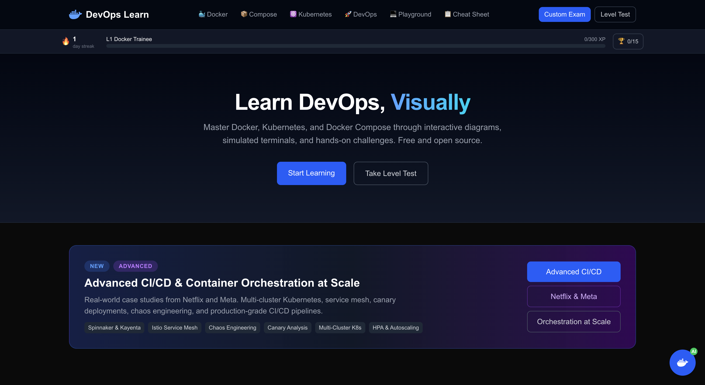

# DevOps Learn

Free, visual learning platform for Docker, Kubernetes, and Docker Compose. Learn through interactive diagrams, simulated terminals, quizzes, and hands-on challenges.



## ☕ Support My Work

If this project helped you, consider [buying me a coffee](https://ko-fi.com/osamaabobakr)! Your support helps me keep building AI tools and useful open-source projects.

## Features

- **Interactive Diagrams** — Explore architecture visually with React Flow. Click nodes, follow data flows, see how containers connect.
- **Terminal Simulator** — Practice real Docker and Kubernetes commands in a simulated terminal with challenge tasks.
- **Quizzes** — Test your knowledge with multiple-choice quizzes and get explanations for every answer.
- **Progress Tracking** — Track your progress across lessons with localStorage (no account needed).
- **Placement Quiz** — Find your starting level with a quick assessment.
- **Cheat Sheet** — Quick reference for common Docker, Compose, and K8s commands.
- **Playground** — Free-form terminal sandbox for practice.
- **i18n** — English and Arabic support with RTL layout.
- **Dark Theme** — Developer-focused dark design with monospace fonts.

## Tech Stack

| Concern | Choice |
|---------|--------|
| Framework | Next.js 15 (App Router) |
| Diagrams | React Flow |
| Terminal | Custom React component |
| Content | MDX (next-mdx-remote) |
| i18n | next-intl |
| Styling | Tailwind CSS |
| Progress | localStorage |
| Deployment | Vercel |

## Getting Started

### Local Development

```bash
# Install dependencies
npm install

# Run dev server
npm run dev
```

Open [http://localhost:3000](http://localhost:3000).

### Docker Development

```bash
docker-compose up
```

Open [http://localhost:3000](http://localhost:3000).

## Project Structure

```
src/
├── app/[locale]/          # Next.js App Router pages
│   ├── learn/             # Module list + lesson pages
│   ├── level-test/        # Placement quiz
│   ├── playground/        # Terminal sandbox
│   └── cheatsheet/        # Quick reference
├── components/
│   ├── diagram/           # React Flow nodes, edges, canvas
│   ├── layout/             # Navbar, Sidebar, Footer, LessonLayout
│   ├── mdx/               # MDX component mapping
│   ├── progress/          # ModuleCard, ProgressBar, LevelBadge
│   ├── quiz/               # QuizComponent
│   └── terminal/          # TerminalSimulator, CommandParser, ChallengePanel
├── context/               # ProgressContext (localStorage)
├── data/
│   ├── challenges/         # Terminal challenge definitions
│   ├── diagrams/           # React Flow diagram configs
│   ├── modules.ts          # Module registry
│   └── quizzes/            # Quiz question data
├── i18n/                  # en.json, ar.json translations
├── lib/
│   ├── content.ts         # MDX content loader
│   ├── mdx.tsx             # MDX renderer
│   └── progress.ts        # localStorage helpers
└── types/index.ts          # Core TypeScript types

content/
├── en/                    # English MDX lessons
└── ar/                    # Arabic MDX lessons
```

## Learning Paths

### Docker Fundamentals
- Beginner: Containers 101, Dockerfile Basics, Volumes & Networks
- Intermediate: Multi-Stage Builds, Docker Security
- Advanced: Production Patterns

### Docker Compose
- Beginner: YAML Basics, Multi-Service Stacks
- Intermediate: Networks & Volumes, Env Vars & Scaling
- Advanced: Production Configs

### Kubernetes Core
- Beginner: Pods & Deployments, Services & Ingress
- Intermediate: ConfigMaps & Secrets, HPA & Scaling
- Advanced: RBAC & Network Policies

### Advanced DevOps
- Intermediate: CI/CD with Containers, Helm Charts
- Advanced: Monitoring & Observability, Security Best Practices

## Adding New Lessons

1. Create an MDX file in `content/en/{topic}/lesson-slug.mdx`
2. Add the lesson entry to `src/data/modules.ts`
3. Optionally create diagram data in `src/data/diagrams/`
4. Optionally create challenge data in `src/data/challenges/`
5. Optionally create quiz data in `src/data/quizzes/`
6. Add Arabic translation in `content/ar/`

## Testing

```bash
npm test
```

## Deployment

Deploy to Vercel with one click:

[](https://vercel.com/new/clone?repository-url=https://github.com/Osama-Abo-Bakr/devops-learn)

Or via CLI:

```bash
npx vercel
```

## License

MIT

---

☕ **Found this useful?** [Support my work on Ko-fi](https://ko-fi.com/osamaabobakr) — it helps me continue building tools like this one.